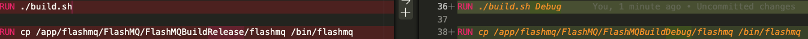
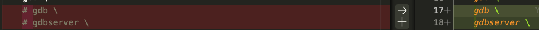

# mqtt-broker-flashmq
[FlashMQ](https://github.com/halfgaar/FlashMQ) fork includes plugin for auth with jwt token decode and verify.

### Purpose
To authenticate a FlashMQ connection using a custom auth plugin that verifies a username (JWT token) against an RSA PEM key passed as a base64-encoded string via the `AUTH_PUBLICKEY` environment variable

### Local Build
Its not straight-forward to compile a C/C++ FlashMQ code for a Mac processor so there is docker-compose.yml provided. To start Flashmq just type `docker-compose up --build --watch` in your favourite terminal for devlopment.
Also `devcontainer` can be attached to the running container for debugging. Line 36-38 in Docker file are updated to run the debug build for FlashMQ
  
and install gdb debug servers in the container 
 
Once the container is running launch your favourite editors debug launch config

## Flash Config
If `allow_anonymous:false` then the plugin will expect `username` field to be not NULL and automatically authenticate.
Thus `plugin` config is not be required to be mentioned as its already loaded the config from the correct path. Make sure if its mentioned the the path is `etc/flashmq/libplugin_libcurl.so` to use the plugin built with `mqtt-broker-flashmq` image.
The docker image places the custom Auth plugin at path  `etc/flashmq/libplugin_libcurl.so` and container will point to the plugin using the config from the image. 

|ENV VARS| default|
|---------|--------|
| AUTH_PUBLICKEY| undefined|

